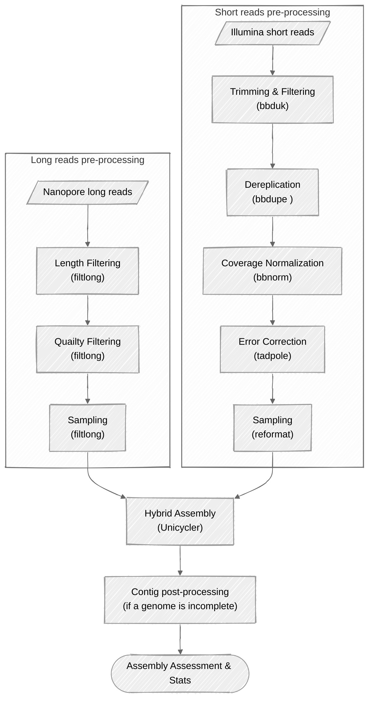

# nf-hybridassembly Workflow

```mermaid
---
config:
  layout:
  look: handDrawn
  theme: neutral
  
---
flowchart TD
subgraph Short reads pre-processing
    shortreads[/Illumina short reads/]-->filtering["Trimming & Filtering
    (bbduk)"]
    filtering --> derep["Dereplication
    (bbdupe )"]
    derep --> cover["Coverage Normalization
    (bbnorm)"]
    cover --> error["Error Correction
    (tadpole)"]
    error --> sampling["Sampling
    (reformat)"]
end

subgraph Long reads pre-processing
    longreads[/Nanopore long reads/]-->lfiltering["Length Filtering
    (filtlong)"]
    lfiltering --> qfiltering["Quailty Filtering 
    (filtlong)"]
    qfiltering --> lsampling["Sampling
    (filtlong)"]
end

    lsampling --> hybrid["Hybrid Assembly
    (Unicycler)"]
    sampling -->hybrid["Hybrid Assembly
    (Unicycler)"]
    hybrid --> post["Contig post-processing
    (if a genome is incomplete)"]
     post --> R(["Assembly Assessment & Stats"])
```